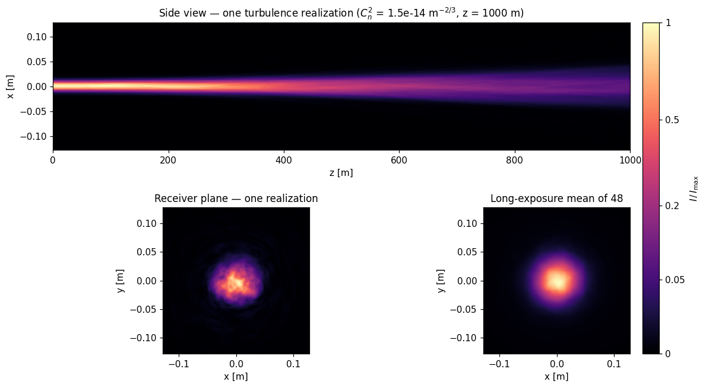

# beamprop

An open, validation-first solver for **laser beam propagation through the atmosphere**, written in Rust.



*One Monte-Carlo realization of a 1 µm beam over 1 km of turbulence (`beamprop turbulence`, rendered by `scripts/render.py`): the instantaneous beam wanders and breaks into speckle; averaging 48 realizations recovers the smooth long-exposure profile that theory predicts to within 0.5%.*

Four effects stack when a laser crosses air, and `beamprop` aims to model each one rigorously and reproducibly:

- **Diffraction** — split-step wave-optics propagation.
- **Attenuation** — molecular and aerosol extinction (Beer–Lambert).
- **Turbulence** — Kolmogorov/von Kármán phase screens: beam wander, spreading, scintillation.
- **Thermal blooming** — the beam heats the air, the refractive index changes, wind and slew clear it, and the beam self-distorts. A coupled radiative-transport ↔ thermal-fluid problem.

## Scope

This repository is **pure propagation physics** — how a beam evolves through air. It deliberately contains no application-specific modeling of any kind, and none is planned here. The physics has broad civilian use: free-space optical communications, lidar, adaptive optics and astronomy, laser machining, and atmospheric science.

Every physical effect is anchored to a closed-form solution or a published benchmark **before** the next effect is added. The validation suite is the project's reason to be trusted.

## Status

Early, built one validated milestone at a time.

| Milestone | Content | State |
|-----------|---------|-------|
| M0 | Crate skeleton, `Field`/`Grid`, `.npy`+PNG output, CI | **done** |
| M1 | Symmetric split-step propagator through a `Medium` trait, validated: Gaussian evolution & divergence <1%, power conservation ~1e-14, boundary wraparound, 2nd-order convergence, long-throw Fresnel path | **done** |
| M2 | Beer–Lambert attenuation via the `Medium` trait, Kruse visibility model, validated: uniform extinction matches `exp(−α·z)` to ~1e-13, transverse absorber removes exactly the predicted power, `α = 0` bit-identical to vacuum | **done** |
| M3 | Von Kármán phase screens (FFT + subharmonics) + reproducible Monte-Carlo, validated: Kolmogorov structure function <10% over a decade of lags, long-exposure spread 0.5% off Andrews–Phillips, scintillation index 1.6% off Rytov, bitwise thread-count reproducibility | **done** |
| M3.5 | M4 pre-spec gate ([docs/M4_SPEC.md](docs/M4_SPEC.md)): fluid model (steady-state isobaric, convection-dominated), slab-local predictor–corrector coupling with a 2nd-order gate, stability/resolution bounds, closed-form anchor benchmark (erf blooming phase) + Gebhardt/Smith trend curve, air-property tabulation pinned (no FFI) | **done** |
| M4 | Coupled thermal blooming (steady-state isobaric, convection-dominated) through a field-aware `Medium`, frozen air-property table, validated: closed-form erf blooming phase 0.39% max, coupling 2nd-order by self-convergence (slope 2.000), weak-blooming first-order limit 0.008% with quadratic back-reaction residual (ratio 3.65 vs 4), stable at N_φ = 20 with closed power budget, upwind bend + crescent + irradiance-rollover signatures, and the Smith-1977 whole-beam I_REL(N) curve reproduced to 7.2% over N ∈ [0.5, 1.8] (F₀ = 5) | **done** |
| M5 | Python bindings (PyO3, abi3) + CI wheels ([docs/M5_SPEC.md](docs/M5_SPEC.md)): `import beamprop` exposes the core classes and `run_*` helpers, validated: CLI compute loops extracted to shared pure runners with bit-identical `.npy` outputs, Python results bit-identical to the CLI for all three cases, closed-form Gaussian width <1% (≈2e-11 observed), seed-exact Monte-Carlo determinism, solver validity errors as `ValueError`; wheels built+gated on linux/macOS/windows in CI | **done** |

## Build & run

```sh
cargo build --release
cargo test

# write a Gaussian field's intensity to out/beam.npy
cargo run --release -- gaussian --n 512 --dx 1e-3 --w0 5e-2 --out beam

# propagate a beam over 2 Rayleigh ranges (side-view map, snapshots, final field)
cargo run --release -- propagate --w0 1e-2 --steps 400 --frames 4 --out beam

# same, through a 5 km-visibility haze (Kruse aerosol extinction at the beam wavelength)
cargo run --release -- propagate --w0 1e-2 --z 200 --visibility 5000 --out hazy

# Monte-Carlo turbulence: receiver-plane + side-view frame stacks and the long-exposure mean
cargo run --release -- turbulence --n 256 --dx 2e-3 --w0 1e-2 --z 1000 --cn2 1.5e-14 --out turb

# thermal blooming: a 20 kW beam heating the air, bending into a 2 m/s crosswind
cargo run --release -- blooming --w0 5e-2 --power 2e4 --wind 2 --alpha-abs 1e-4 --z 500 --out bloom

# render the images: GIFs/PNGs with physical axes and a labeled colorbar (matplotlib)
python3 scripts/render.py out/turb

# remove generated results (images, .npy and sidecars in the output directory)
cargo run --release -- clean
```

The solver writes **data** (`.npy` arrays plus `_meta.json`/`_notes.md` sidecars); all images come from `python3 scripts/render.py <basename>`. Generated files land in `out/` by default (`--out-dir` overrides). Each `propagate`/`turbulence` run's `<out>_notes.md` describes the test case: parameters, derived physical quantities (Rayleigh range, Fried parameter, Rytov variance, …), what each file contains with its physical axes, and how the images are normalized. `cargo run --release -- --help` (or `--help` on any subcommand) lists all options.

## Python bindings

The same solver is importable from Python (PyO3/maturin, `beamprop-py/`):

```sh
pip install maturin
maturin develop --release -m beamprop-py/Cargo.toml   # or: pip install a CI wheel
```

```python
import beamprop as bp

# high-level: one call per CLI case, numpy arrays + diagnostics back
r = bp.run_blooming(w0=5e-2, power=2e4, wind=2.0, alpha_abs=1e-4, z=500.0)
print(r["n_phi"], r["centroid_x"], r["final"].shape)

# or compose the pieces: propagate a field step by step through a medium
g = bp.Grid(512, 1e-3)
f = bp.Field.gaussian(g, 1.0e-6, 1e-2)
m = bp.Medium.turbulence(g, 1.0e-6, cn2=1.5e-14, l0=1e3, z=1000.0, screens=10, seed=1)
bp.Propagator(g, 1.0e-6).propagate(f, m, dz=1000.0 / 10, steps=10)
speckle = f.intensity          # numpy, ready to plot
```

The bindings return **data only** (rendering stays in `scripts/render.py`), and their gate suite requires Python results to be bit-identical to the CLI (`beamprop-py/tests/`, run in CI and against every built wheel).

Every physical model in the solver — equation, implementation site, validation gate, and literature reference — is catalogued in [docs/MODELS.md](docs/MODELS.md).

## License

Licensed under the Apache License, Version 2.0 ([LICENSE](LICENSE) or <https://www.apache.org/licenses/LICENSE-2.0>). Unless you explicitly state otherwise, any contribution intentionally submitted for inclusion in the work by you, as defined in the Apache-2.0 license, shall be licensed as above, without any additional terms or conditions.
