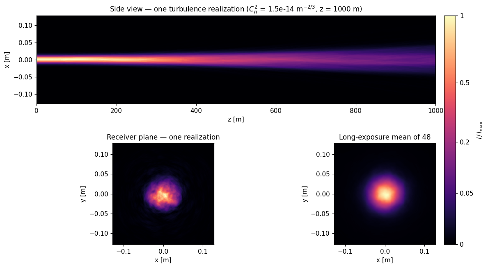

# beamprop

An open, validation-first solver for **laser beam propagation through the atmosphere**, written in Rust.



*One Monte-Carlo realization of a 1 µm beam over 1 km of turbulence (`beamprop turbulence`, rendered by `scripts/render.py`): the instantaneous beam wanders and breaks into speckle; averaging 48 realizations recovers the smooth long-exposure profile that theory predicts to within 0.5%.*

Several effects stack when a laser crosses air, and `beamprop` aims to model each one rigorously and reproducibly:

- **Diffraction** — split-step wave-optics propagation.
- **Attenuation** — molecular and aerosol extinction (Beer–Lambert).
- **Turbulence** — Kolmogorov/von Kármán phase screens: beam wander, spreading, scintillation.
- **Thermal blooming** — the beam heats the air, the refractive index changes, wind and slew clear it, and the beam self-distorts. A coupled radiative-transport ↔ thermal-fluid problem.
- **Optical breakdown** *(in progress)* — above a threshold irradiance the air ionizes: an electron avalanche, then a plasma that absorbs the beam that made it. A standalone 0-D rate kernel (M6a) supplies the ignition threshold.
- **Laser-supported detonation** — once lit, that plasma does not sit still: the absorption wave runs *back up the beam* toward the laser as a detonation, at kilometres per second, closing the channel behind it. A 1-D Euler solver with laser deposition (M6c), coupled to the propagator as a pure absorber.

## Scope

This repository is **pure propagation physics** — how a beam evolves through air. It deliberately contains no application-specific modeling of any kind, and none is planned here. The physics has broad civilian use: free-space optical communications, lidar, adaptive optics and astronomy, laser machining, and atmospheric science.

Every physical effect is anchored to a closed-form solution or a published benchmark **before** the next effect is added. The validation suite is the project's reason to be trusted.

## Status

Early, built one validated milestone at a time.

| Milestone | Content | State |
|-----------|---------|-------|
| M0 | Crate skeleton, `Field`/`Grid`, `.npy`+PNG output, CI | **done** |
| M1 | Symmetric split-step propagator through a `Medium` trait, validated: Gaussian evolution & divergence <1%, power conservation ~1e-14, boundary wraparound, 2nd-order convergence, long-throw Fresnel path | **done** |
| M2 | Beer–Lambert attenuation via the `Medium` trait, Kruse visibility model, validated: uniform extinction matches `exp(−α·z)` to ~1e-13, transverse absorber removes exactly the predicted power, `α = 0` bit-identical to vacuum | **done** |
| M3 | Von Kármán phase screens (FFT + subharmonics) + reproducible Monte-Carlo, validated: Kolmogorov structure function <10% over a decade of lags, long-exposure spread 0.5% off Andrews–Phillips, scintillation index 1.6% off Rytov, bitwise thread-count reproducibility | **done** |
| M3.5 | M4 pre-spec gate ([docs/M4_SPEC.md](docs/M4_SPEC.md)): fluid model (steady-state isobaric, convection-dominated), slab-local predictor–corrector coupling with a 2nd-order gate, stability/resolution bounds, closed-form anchor benchmark (erf blooming phase) + Gebhardt/Smith trend curve, air-property tabulation pinned (no FFI) | **done** |
| M4 | Coupled thermal blooming (steady-state isobaric, convection-dominated) through a field-aware `Medium`, frozen air-property table, validated: closed-form erf blooming phase 0.39% max, coupling 2nd-order by self-convergence (slope 2.000), weak-blooming first-order limit 0.008% with quadratic back-reaction residual (ratio 3.65 vs 4), stable at N_φ = 20 with closed power budget, upwind bend + crescent + irradiance-rollover signatures, and the Smith-1977 whole-beam I_REL(N) curve reproduced to 7.2% over N ∈ [0.5, 1.8] (F₀ = 5) | **done** |
| M5 | Python bindings (PyO3, abi3) + CI wheels ([docs/M5_SPEC.md](docs/M5_SPEC.md)): `import beamprop` exposes the core classes and `run_*` helpers, validated: CLI compute loops extracted to shared pure runners with bit-identical `.npy` outputs, Python results bit-identical to the CLI for all three cases, closed-form Gaussian width <1% (≈2e-11 observed), seed-exact Monte-Carlo determinism, solver validity errors as `ValueError`; wheels built+gated on linux/macOS/windows in CI | **done** |
| M6a | 0-D optical-breakdown threshold kernel ([docs/M6A_SPEC.md](docs/M6A_SPEC.md)): electron-avalanche balance (inverse-bremsstrahlung heating − inelastic loss − attachment − diffusion), exact per-slice logistic integrator, log-bisection threshold, pressure sweep, `breakdown` CLI case. Validated against Thiyagarajan & Thompson 2012 (Fig. 4, digitized): collision frequency 1.05× of literature and flat over 46–1858 Torr, `E_eff(p)` slope `p^+0.695` vs predicted `p^+0.642`, wavelength scaling `λ^-2.000` over a 20× span matching the paper's cascade closed form (Eq. 4) with the plateau coefficient agreeing to 1.01×. **Known red gate:** the measured `I_thr(p)` slope (`p^-0.329`) is unreachable by any cascade-only kernel — the measurement is 12% multiphoton at 760 Torr — so that gate is `#[ignore]`d and the model is bracketed instead; absolute level sits inside the ungated 3–10× inter-lab scatter. The independent-anchor debt this leaves open is recorded in [docs/MODELS.md](docs/MODELS.md) | **done, one gate red by design** |
| M6c.0 | M6c pre-spec gate ([docs/M6C_SPEC.md](docs/M6C_SPEC.md)): 1-D Euler + laser deposition for the laser-supported-detonation wave — laser-agnostic HLLC/MUSCL-Hancock core, Strang-split source, plasma column coupled to the propagator as absorption-only (read-only `Medium`, no Drude index), offline plasma-property table. Gates pinned before code: Sod + observed-order (solver verification), Raizer's LSD velocity closed form (**verification, not validation** — it is the Chapman–Jouguet construction the model is built from), the parameter-free `D ∝ S^(1/3)`, `ρ₀^(−1/3)` scaling as the physics gate, energy-budget closure, table consistency, and absolute velocity vs measurement documented but ungated (a planar solver has no radial relief, so the known experimental gap is a prediction of the omissions) | **done** |
| M6c | Laser-supported detonation wave ([docs/M6C_SPEC.md](docs/M6C_SPEC.md)): laser-agnostic 1-D Euler core (HLLC + MUSCL-Hancock, minmod, per-step CFL, positivity guard that bails rather than clamps), `IntensityScale` extracted from M4 (T4), frozen equilibrium plasma table to 30,000 K, the coupled `LsdColumn` driver (Beer–Lambert attenuation, discretely conservative deposition, Strang-split source), and the `lsd` CLI case + `scripts/render_lsd.py`. **Verification:** Sod vs the exact Riemann solution, L1(ρ) 6.55e-3 → 6.55e-4 over n = 100 → 1600 at rate 0.79–0.88 (G1); observed order 1.86 → 1.94 on smooth flow (G2); coupled hydro↔source order 1.99/2.03/1.99 against a deliberate 1st-order contrast at 0.88/1.02/1.07 (G2b); Raizer's LSD velocity 5402 vs 5392 m/s, +0.19% (G3 — **verification, not validation**: it is the Chapman–Jouguet construction the model is built from); residual −8.26% → +0.19% as the absorption layer halves (G3b); seed-independent to 1.1e-3 (G3c); energy budget closed to 2.1e-16 (G5); plasma table vs direct Mutation++ off-grid, worst 1.48e-3 in `n_e` (G6); a real beam marched through the plasma column matching `exp(−τ)` to 1.7e-13 at τ = 339, with `δn ≡ 0` asserted at every slab (G8 — D7's absorption-only coupling, gated end to end). **Physics gate (G4):** `D ∝ S^(+0.33190)` over 1.52 decades and `ρ₀^(−0.33020)` over 1.50 decades, gated inside ±0.01 of ±1/3, with the level shown to move 59% under `γ` while the exponents move by 0.001. The demonstration run ignites at the M6a threshold and tracks the wave (`D` = 5401 vs 5391 m/s); its headline is that M6a's threshold is an *intensity floor* — it does not fall with pulse length — so the sustaining drive sits 10⁵ below the intensity that could light the wave, which is the model reproducing why an LSD wave needs a separate initiating spark. G7 (absolute velocity vs measurement) is documented and **ungated on purpose**: a planar solver has no radial relief | **done** |

### Next

| Milestone | Content | State |
|-----------|---------|-------|
| M6a.2 | Monte-Carlo ignition: the M6a 0-D kernel evaluated per realization with propagator coupling — where a beam breaks down first, and how that varies. Needs a pre-spec before code, per the project's discipline | **next, not started** |
| Bindings v2 | Python entry points for the M6 cases (`run_breakdown`, `run_lsd`, M6a.2), so the cases can be driven from notebooks. Rendering stays in `scripts/render*.py`. Scheduled after M6a.2 — see [docs/M5_SPEC.md](docs/M5_SPEC.md) § Planned | **planned** |
| M6b | Full-Drude plasma shielding. **Deferred, and broken as specified**: a paraxial split-step envelope cannot carry a near-critical plasma, so reviving it needs a non-paraxial solver rather than a new `Medium`. Reason recorded in [docs/M6C_SPEC.md](docs/M6C_SPEC.md) § NOT in scope | **deferred** |

## Build & run

```sh
cargo build --release
cargo test

# write a Gaussian field's intensity to out/beam.npy
cargo run --release -- gaussian --n 512 --dx 1e-3 --w0 5e-2 --out beam

# propagate a beam over 2 Rayleigh ranges (side-view map, snapshots, final field)
cargo run --release -- propagate --w0 1e-2 --steps 400 --frames 4 --out beam

# same, through a 5 km-visibility haze (Kruse aerosol extinction at the beam wavelength)
cargo run --release -- propagate --w0 1e-2 --z 200 --visibility 5000 --out hazy

# Monte-Carlo turbulence: receiver-plane + side-view frame stacks and the long-exposure mean
cargo run --release -- turbulence --n 256 --dx 2e-3 --w0 1e-2 --z 1000 --cn2 1.5e-14 --out turb

# thermal blooming: a 20 kW beam heating the air, bending into a 2 m/s crosswind
cargo run --release -- blooming --w0 5e-2 --power 2e4 --wind 2 --alpha-abs 1e-4 --z 500 --out bloom

# 0-D optical breakdown (M6a): threshold vs pressure + the electron avalanche
cargo run --release -- breakdown --out breakdown

# laser-supported detonation (M6c): a spark at the M6a threshold, then the
# absorption wave running back up the beam toward the laser
cargo run --release -- lsd --out lsd

# render the images: GIFs/PNGs with physical axes and a labeled colorbar (matplotlib)
python3 scripts/render.py out/turb
python3 scripts/render_breakdown.py out/breakdown   # breakdown runs
python3 scripts/render_lsd.py out/lsd               # LSD runs

# remove generated results (images, .npy and sidecars in the output directory)
cargo run --release -- clean
```

The solver writes **data** (`.npy` arrays plus `_meta.json`/`_notes.md` sidecars); all images come from `python3 scripts/render.py <basename>` (or `scripts/render_breakdown.py` for `breakdown` runs, which are 0-D rate physics rather than fields). Generated files land in `out/` by default (`--out-dir` overrides). Each `propagate`/`turbulence` run's `<out>_notes.md` describes the test case: parameters, derived physical quantities (Rayleigh range, Fried parameter, Rytov variance, …), what each file contains with its physical axes, and how the images are normalized. `cargo run --release -- --help` (or `--help` on any subcommand) lists all options.

## Python bindings

The same solver is importable from Python (PyO3/maturin, `beamprop-py/`):

```sh
pip install maturin
maturin develop --release -m beamprop-py/Cargo.toml   # or: pip install a CI wheel
```

```python
import beamprop as bp

# high-level: one call per field-propagation case, numpy arrays + diagnostics back
r = bp.run_blooming(w0=5e-2, power=2e4, wind=2.0, alpha_abs=1e-4, z=500.0)
print(r["n_phi"], r["centroid_x"], r["final"].shape)

# or compose the pieces: propagate a field step by step through a medium
g = bp.Grid(512, 1e-3)
f = bp.Field.gaussian(g, 1.0e-6, 1e-2)
m = bp.Medium.turbulence(g, 1.0e-6, cn2=1.5e-14, l0=1e3, z=1000.0, screens=10, seed=1)
bp.Propagator(g, 1.0e-6).propagate(f, m, dz=1000.0 / 10, steps=10)
speckle = f.intensity          # numpy, ready to plot
```

The bindings return **data only** (rendering stays in `scripts/render.py`), and their gate suite requires Python results to be bit-identical to the CLI (`beamprop-py/tests/`, run in CI and against every built wheel). They cover the three field-propagation cases; the 0-D `breakdown` case is Rust/CLI-only for now.

Every physical model in the solver — equation, implementation site, validation gate, and literature reference — is catalogued in [docs/MODELS.md](docs/MODELS.md).

## License

Licensed under the Apache License, Version 2.0 ([LICENSE](LICENSE) or <https://www.apache.org/licenses/LICENSE-2.0>). Unless you explicitly state otherwise, any contribution intentionally submitted for inclusion in the work by you, as defined in the Apache-2.0 license, shall be licensed as above, without any additional terms or conditions.
